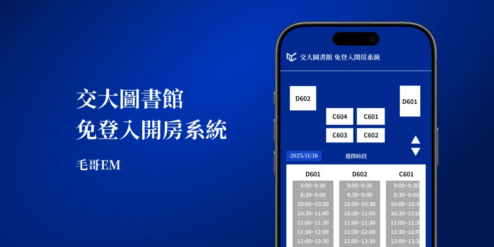

# 交大圖書館免登入開房系統

不登入交大圖書館系統的情況下，與你的好友一起開包廂，享受私密的單獨時光。

<https://nyculib.elvismao.com/>



## 解決痛點

- 每次登入只會維持 20 分鐘，基本上等於每次都需要重新登入，輸入很容易看錯的驗證碼。 -> 自動完成登入
- 手機版網頁看不到地圖，很難知道是哪一間。 -> 畫一張給你
- 哪間有沒有空位需要一個個單獨檢查。 -> 一次看完所有空位
- 預約遲到 30 分鐘會被取消並且記點。 -> 每次預約 29 分鐘，分開約，永遠不會超過
- 進去之後卡片記得要放在裡面，不然 30 分鐘沒卡會自動退房。 -> 同上
- 單次最多只能預約 4 小時。 -> 前端擋的，API 其實沒有這限制
- 只能預約 14 天以內的時段。 -> 前端擋的，API 其實沒有這限制，你可以預約 2030 的討論室
- 不能幫別人預約。 -> 後端其實不會管預約是誰，你可以幫任何人預約

## 開發

請先安裝 [Node.js](https://nodejs.org/) 及 [pnpm](https://pnpm.io/installation)，接著執行：

安裝 Chrome Driver 或是任意瀏覽器：

```
npx puppeteer browsers install chrome
```

設定環境變數 `.env`（可參考 `.env.example`）：

```
NYCU_USERNAME=114000000
NYCU_PASSWORD=yourpasswordhere
```

安裝相依套件並啟動開發伺服器：

```bash
pnpm i
pnpm dev
```

## 技術細節

### Token

圖書館討論室預約系統的 API 很複雜且噁心，是幾個架構混在一起出來的。

* 圖書館的系統、單一登入系統、預約系統分別是三個登入，各自有自己的 token。
* Session Token 有時放 Cookie，有時用 URL Param 傳，有時放 body，有時在 localstorage。
  * 在不同地方會有不同的名字，但是內容是一樣的。
  * 有一些 token 沒有用，純粹虛晃。
  * 預約系統 token 存 localstorage，而且不演了系統每次請求會直接 console.log 印出來。
* 因為研究了一個晚上沒有研究出預約系統的 token 是怎麼來的（感覺是前端生的，但沒找到）只好透過動態爬蟲解決。先拿到 session token 之後再用 API 來呼叫。

### 驗證碼

爬蟲登入需要輸入驗證碼。由於字體會旋轉且有些數字長得很像，我人眼都常常會看錯。因此就算先經過降噪，Tesseract.js 還是認不太出來。因此手動下載標記了兩百張驗證碼然後使用 PyTorch 訓練出來一個小模型來處理。

### API

其他就是理解圖書館預約系統噁心的 API。除了傳的資料，回傳的資料格式以外。要知道有沒有成功也挺抽象的。你可能會收到以下回覆：

* 200 空白的 HTML -> 代表失敗
* 200 XML -> 代表失敗
* 200/301 HTML -> 可能是成功也可能是失敗，通常是失敗
* 200 JSON -> 不一定。有時候陣列有時候物件，有時候沒狀態碼。格式可能是以下幾種：
  * `[{"rescode":"1","resmsg":"成功","resdata":{...}}]`
  * `{"rescode":1,"resmsg":"成功","rows":[...]}`
  * `{"MAPS": {}}`

## 免責聲明

- 此系統與國立陽明交通大學無關。
- 此專案僅供學術用途，以及看噁心 Code 的壓力訓練。

## 授權條款

本專案採用[你他媽的想幹嘛就幹嘛公眾授權條款](https://www.wtfpl.net/)授權，詳情請參閱 [LICENSE](./LICENSE) 檔案。

